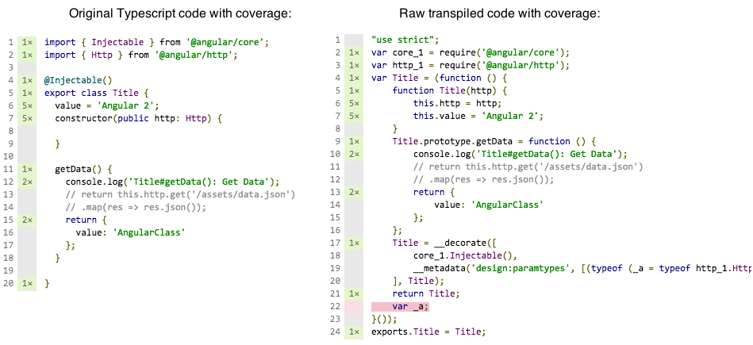

# karma-remap-coverage
Karma reporter that shows coverage for original non transpiled code (TypeScript, ES6/7, etc).

Build on top of `karma-coverage` and `remap-istanbul` - consumes coverage report for raw code and maps it to original files. Transpiler should generate source maps in order to make everything work.

Needs no temporary files nor npm post run scripts, works in "watch" mode generating report on every change.



##Installation
```
npm install karma-remap-coverage --save-dev
```

##Configuration
1. Enable source maps in your compiler config
2. Configure karma config to use `karma-coverage` together with `karma-remap-coverage`:
    * add `remap-coverage` to reporters list: `reporters: ['progress', 'coverage', 'remap-coverage']`
    * save interim coverage report in memory: `coverageReporter: { type: 'in-memory' }`
    * define where to save final reports: `remapCoverageReporter: { html: './coverage' }`
3. Optionally - configure [remap options](https://github.com/SitePen/remap-istanbul#libremap) in karma config: `remapOptions: { basePath: './dist' }`

##remapCoverageReporter format
Key-value pairs where key is report type and value - path to file/dir where to save it. Reporters like `text-summary`, `text-lcov` and `teamcity` can print out to console as well - in this case just provide any falsy value instead of path.
Example:
```javascript
remapCoverageReporter: {
  'text-summary': null, // to show summary in console
  html: './coverage/html',
  cobertura: './coverage/cobertura.xml'
}
```

##TypeScript + webpack example
Karma config with alternative usage of `karma-webpack` should look something like this:

**tsconfig.json**
```
{
  "compilerOptions": {
    "sourceMap": true
    ...
  }
}
```

**karma.conf.js**
```javascript
module.exports = config => config.set({
  
  files: [
    './entry-module.spec.ts'
  ],
  preprocessors: {
    './entry-module.spec.ts': ['webpack', 'sourcemap'],
    './entry-module.ts': ['coverage']
  },
  
  ...
  
  // add both "karma-coverage" and "karma-remap-coverage" reporters
  reporters: ['progress', 'coverage', 'remap-coverage'],
  
  // save interim raw coverage report in memory
  coverageReporter: {
    type: 'in-memory'
  },
  
  // define where to save final remaped coverage reports
  remapCoverageReporter: {
    'text-summary': null,
    html: './coverage/html',
    cobertura: './coverage/cobertura.xml'
  },
  
  // make sure both reporter plugins are loaded
  plugins: ['karma-coverage', 'karma-remap-coverage']
  
});
```
